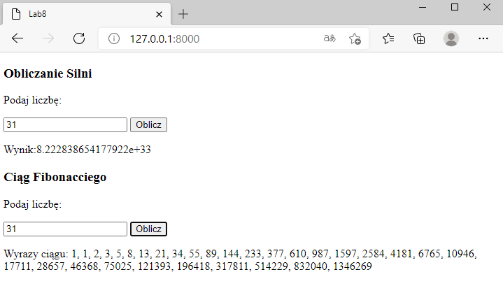

# Laboratorium numer 8

Laboratorium miało na celu zapoznanie się z Web Socket i Web Workersami.

## Web Socket:

W ramach zapoznania się z Web Socketami wykonano chat z wykorzystaniem socket.io z [przykładu](https://socket.io/get-started/chat/).

Wygląd zrealizowanego chatu:

## Web workers:

Zrealizowano również obliczenia silni oraz ciągu fibonacciego przy pomocy web workerów:

